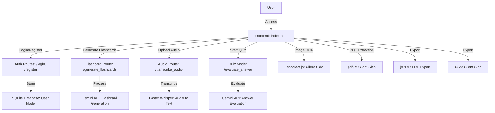
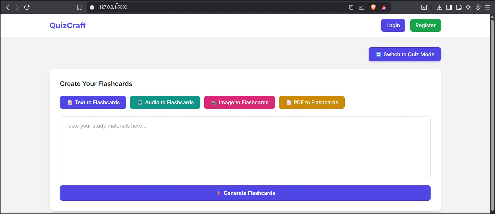
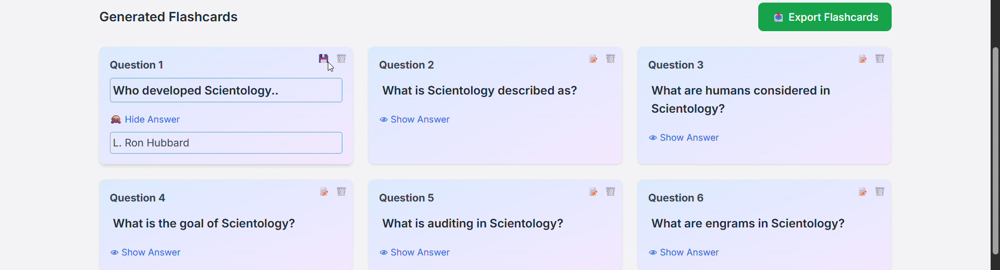
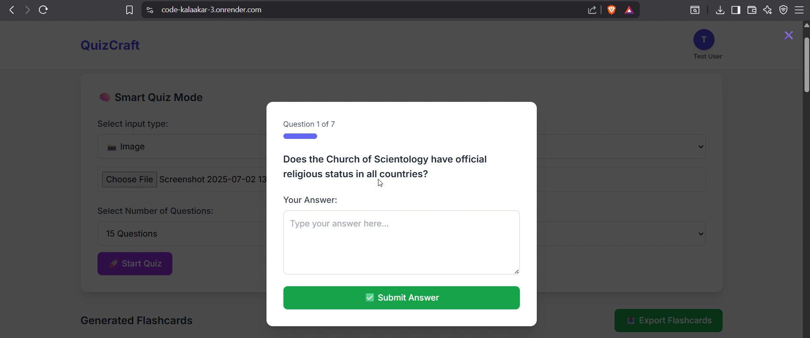
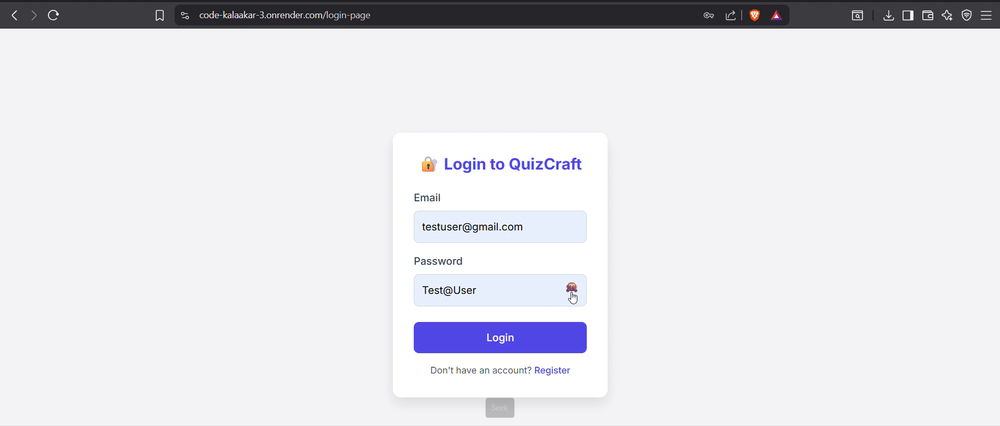
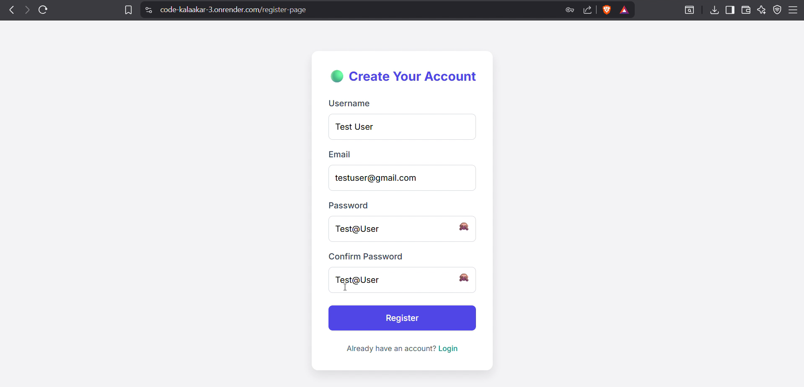

# 🎓 QuizCraft

## 📘 Project Description

QuizCraft is a web application designed to help users create and study flashcards from various input types, including text, audio, images, and PDFs. It also features a smart quiz mode to test knowledge, with functionalities like flashcard generation, editing, exporting, and performance tracking. The application leverages AI for content processing and provides a user-friendly interface for educational purposes.

---

## 🛠 Technology Stack

**Backend:**  
Python, Flask, Flask-SQLAlchemy, Flask-Bcrypt, Flask-Session  

**Frontend:**  
HTML, CSS (Tailwind CSS), JavaScript  

**AI Integration:**  
Google Generative AI (Gemini API) for flashcard generation and answer evaluation  

**Audio Processing:**  
Faster Whisper for audio transcription  

**Client-Side Libraries:**  
- Tesseract.js for image OCR  
- pdf.js for PDF text extraction  
- jsPDF and autoTable for PDF export  

**Database:**  
SQLite (configurable via `DATABASE_URL`)  

**Environment Management:**  
python-dotenv for environment variables  

---

## ✅ Features Implemented

### 🔐 User Authentication
- Register and login with email, username, and password  
- Secure session management and password hashing with Bcrypt  
- Logout functionality  

### 📋 Flashcard Generation
- Generate flashcards from text, audio, image, or PDF inputs  
- AI-powered flashcard creation using Gemini API  
- Cache generated flashcards for efficiency  

### 📝 Flashcard Management
- Edit and delete flashcards  
- Export flashcards to PDF or CSV  

### 🔄 Input Processing
- Audio transcription using Faster Whisper  
- Image OCR using Tesseract.js  
- PDF text extraction using pdf.js  

### 🧠 Quiz Mode
- Start quizzes from various input types  
- Customizable question count  
- Real-time answer evaluation with feedback  
- Quiz progress tracking with a progress bar  
- Generate detailed quiz reports in PDF format  

### 🔒 Security Features
- Prevent text copying, screenshots, and right-click during quizzes  

### 💻 Responsive UI
- Tailwind CSS for modern, responsive design  
- Interactive flashcard and quiz interfaces  

---

## ⚙️ Setup and Installation Instructions

### 1. Clone the Repository
```bash
git clone https://github.com/HarshDhebe4277/Code-Kalaakar
cd quizcraft
```

### 2. Set Up a Virtual Environment
#### For Windows:
```bash
python -m venv venv
venv\Scripts\activate
```

#### For Mac/Linux:
```bash
python3 -m venv venv
source venv/bin/activate
```

### 3. Install Python Dependencies
```bash
pip install -r requirements.txt
```

> If you don’t have a `requirements.txt` file yet, create one with:
> ```
> flask
> flask-sqlalchemy
> flask-bcrypt
> flask-session
> python-dotenv
> faster-whisper
> google-generativeai
> ```

### 4. Create a `.env` File
In the project root, create a `.env` file with the following contents:
```
SECRET_KEY=your_secret_key
DATABASE_URL=sqlite:///quizcraft.db
GEMINI_API_KEY=your_gemini_api_key
```

### 5. Initialize the Database
Open a Python shell and run:
```python
from app import app, db
with app.app_context():
    db.create_all()
```

### 6. Start the Development Server
```bash
python app.py
```

Visit [http://localhost:5000](http://localhost:5000) in your browser.

### 7. Frontend Dependencies (Already Included via CDN in `index.html`)
- Tailwind CSS  
- Tesseract.js  
- pdf.js  
- jsPDF + autoTable  

---
## 🌐 Link to Deployed Application

👉 https://code-kalaakar-3.onrender.com/

> **Note:** Due to resource limitations on Render (which offers only ~500MB free storage), the audio-related features powered by Whisper (like *Audio to Flashcards* and *Audio-based Quiz Generation*) are not functional in the deployed version.  
> These features require more disk space than Render allows.  
> ✅ To see these features in action, please watch the demo walkthrough video below.

---


## 🎥 Walkthrough Video
- Watch a full walkthrough of QuizCraft here: [Watch Now](https://youtu.be/U5VrUPWq-Vc)

---

## 🎨 Figma UI Prototype

- Explore the UI/UX design in Figma: [View Prototype](https://www.figma.com/design/4M5Z8PRYSXyLipA1Pugktj/Untitled?node-id=0-1&t=ZixTDjoTwm7iTP1o-1
)

---

## 📊 Project Presentation

- Check out our final project presentation slides: [View Presentation](https://www.canva.com/design/DAGr67M9ezI/B6gZXmINBqZdyDnuSu0b3A/edit?utm_content=DAGr67M9ezI&utm_campaign=designshare&utm_medium=link2&utm_source=sharebutton)

---


## 🧭 App Flow / System Architecture



---

## 📸 Screenshots of the User Interface


### 🏠 Home Page
- Input options: Text, Audio, Image, PDF  
- Login/Register buttons  


### 📋 Flashcard View
- Flashcards with edit/delete/show/export options  


### 🧪 Quiz Mode
- Modal UI, progress bar


### 🔐 Login/Register Pages
- Styled user authentication forms  
  

